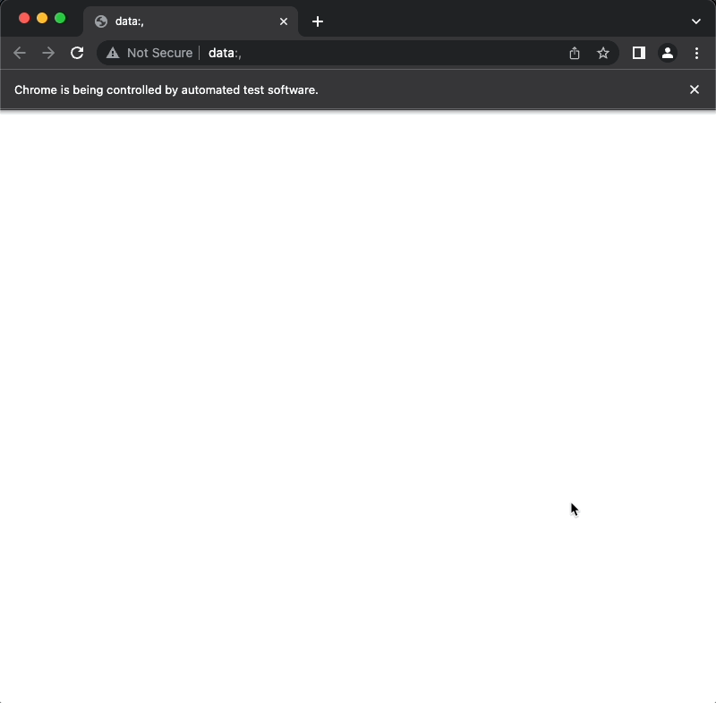

# Challenge 1: Use Selenium to Scrape Website Data

Extract the upcoming event data from the python.org website. Use Selenium to scrape all upcoming event dates and event names and store them in a nested Python dictionary. Print the dictionary to the console. The event data from python.org should be stored under the keys "time" and "name".

>For this challenge, we scrape the Upcoming Events section from [Python.org](https://python.org).

>Run Python code: [`scrape_website_data.py`](scrape_website_data.py)

### Upcoming Events data

### Dictionary Output

# Challenge 2: Use Selenium in a Blank Project & Scrape a Different Piece of Data

Create a blank file called interaction.py. Use Selenium to print the total number of articles from the Wikipedia homepage to the PyCharm console.

>For this challenge, we scrape the number of total [Wikipedia](https://en.wikipedia.org/wiki/Main_Page) articles from the front page.

>Run Python code: [`interactions.py`](interactions.py)

### Top of Wikipedia front page

### Number of Wikipedia articles

# Challenge 3: How to Automate Filling Out Forms and Clicking Buttons with Selenium

Practice using Selenium to fill in the form and click `Sign Up` on a practice webpage.

>For this challenge, we practice signing up on [The Lab Report](http://secure-retreat-92358.herokuapp.com/).  Note this is not a real registration page. 

>Run Python code: [`automate_form_fill.py`](automate_form_fill.py)

### Webpage form

### Automating form fill

