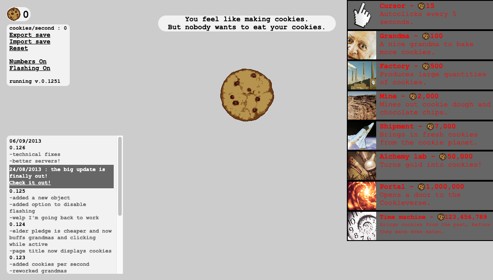
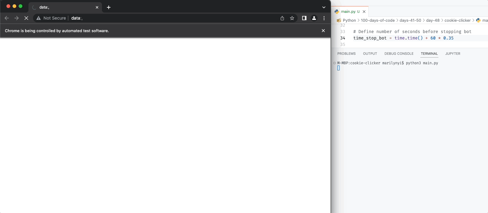

# Day 48: Cookie Clicker

Create a bot using Selenium and Python to click on the cookie as fast as possible in the [Cookie Clicker game](http://orteil.dashnet.org/experiments/cookie/).

- Every 5 seconds, check the right-hand pane to see which upgrades are affordable and purchase the most expensive one. 

    You'll need to check how much money (cookies) you have against the price of each upgrade. e.g. both Grandma and Cursor are affordable as we have 103 cookies, but Grandma is the more expensive one, so we'll purchase that instead of the cursor.

- After 5 minutes have passed since starting the game, stop the bot and print the "cookies/second" in the terminal.

## Game start screen

To gain points and progress, you click the cookie repeatedly. Upgrades on the right can be clicked to purchase once you have enough cookies. The current number of cookies is on the top left.

Whenever a purchase is made, a graphical element for that upgrade will appear near the center cookie.

## Bot test run

We alter the program duration from 5 minutes down to 21 seconds temporarily to show a test run from start to finish.

Logging details are printed on the screen every five seconds when a purchase is made. Once the bot ends, the cookies per second is printed in the terminal.

