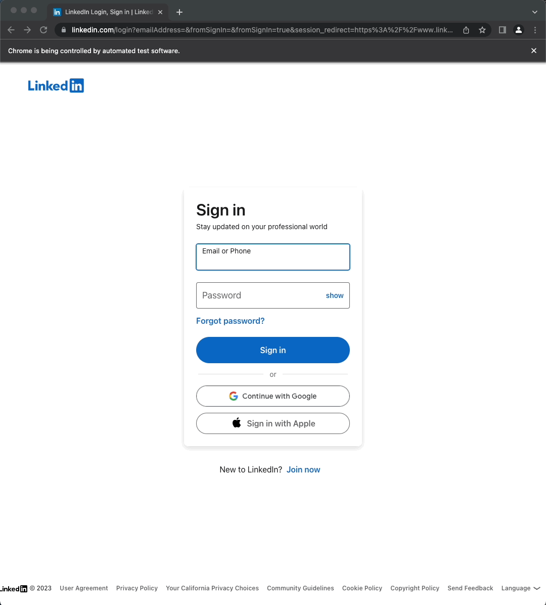

# Day 49: LinkedIn Easy Apply

Use Selenium to automate applying for jobs.

For this project, the code was written based on the following:

LinkedIn settings:
- Already had an existing LinkedIn account
- Preloaded contact info and resume in the job application settings located at: `Me` -> `Settings & Privacy` -> `Data privacy` -> `Job seeking preferences` -> `Job application settings`
- At minimum, set job search filter to include `Easy Apply`. Customize all job filters and then copy the entire URL.

Code execution:
- The browser will try to open the customed LinkedIn Jobs URL.
- Sign-in is automated before accessing the Jobs webpage.
- Script will select each job in the list and either:
    - Cancel and discard applications if, after clicking `Easy Apply`, the first page of the pop-up window does not have a `Submit application` button, or
    - Submit application if they are truly "easy" to apply to.

## Using Selenium to sign in to LinkedIn

## Successfully loading the Jobs list

