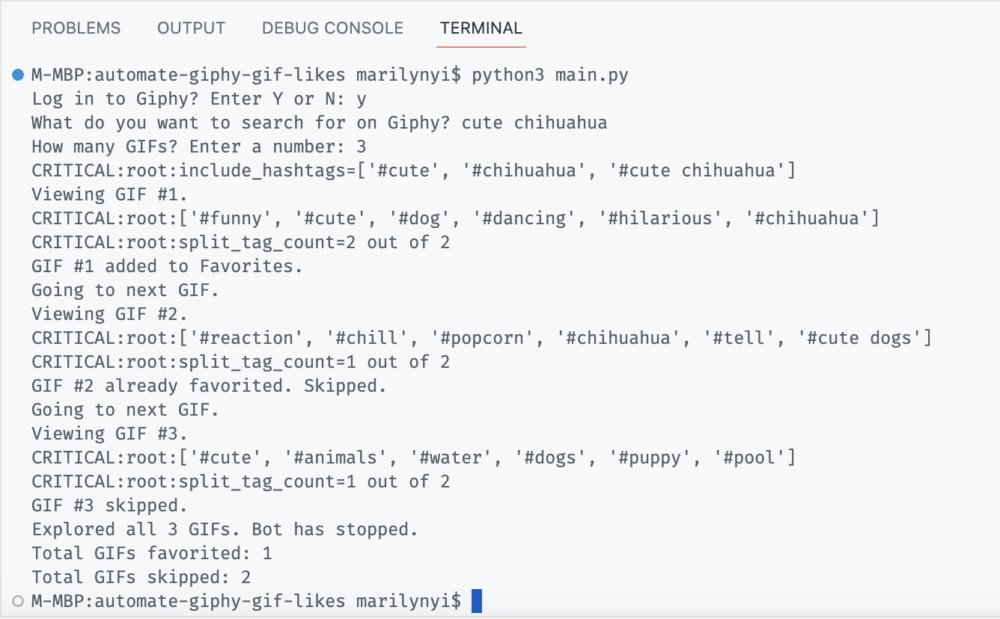
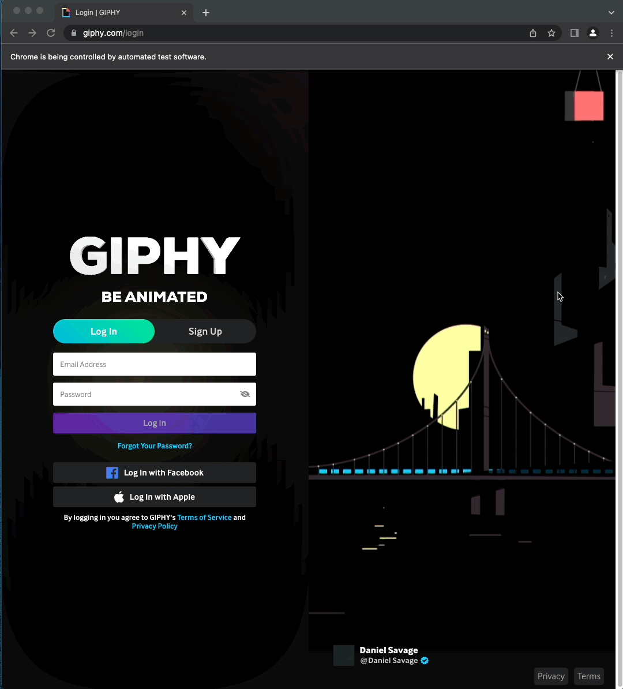

# Day 50: Automate Giphy GIF Likes

This day's course project was to create a Tinder bot to automatically match with profiles by liking or disliking. 

I adapted this project by creating a Giphy bot instead to automatically match hashtags of GIFs with the user's search phrase. If they match, the GIF is saved to `Favorites`; otherwise, the GIF is skipped.

[giphy.com](https://giphy.com) was chosen to develop a family-friendly alternative while somewhat preserving the "swipe left or right" functionality of Tinder. 

## Output example (three GIFs)

We ask the user in the terminal for three inputs:

- `GIPHY_ACCOUNT` = `'y'`: log in to Giphy account
- `SEARCH_FOR` = `'cute chihuahua'`: search phrase to look up GIFs
- `GIF_COUNT` = `'3'`: number of GIFs to "swipe" through

### Picture Examples shown in following demo:

- GIF #1 has all split hash tags `#cute` and `#chihuahua` so it gets favorited.

    

- GIF #2 is already favorited so it gets skipped regardless of hash tag matches.

    

- GIF #3 does not have either of the following:
    - **all split hash tags**: `#cute` and `#chihuahua`, or 
    - the original search phrase as a hash tag: `#cute chihuahua` 

    so it gets skipped.

    

### Demo of all three GIFs

**Note**: The ♥️ has a misleading visual delay at the start of each GIF because of the sleep() function in the example above.

## Bot script steps

### Console output

### Manual inputs in the terminal
- Prompts user in the terminal if they want to log in to Giphy
    - Valid inputs: `Y`, `y`, `N`, and `n`
    - Reprompt if invalid input
- Prompts user in the terminal for a search phrase
    - Reprompt if empty
- Prompts user for number of GIFs to look through
    - Reprompt if not an integer

### Browser load options

- **Option 1: If logging in to Giphy**
    - Opens default giphy.com page
        - Note: Logging in to Giphy takes you automatically to your channel page
    - Enters search phrase in Search bar to go to results

- **Option 2: If continuing as guest user**
    - Opens giphy.com page with search phrase added to URL

### Website navigation

- Clicks on the first GIF in the list of searches
- Clicks `Favorite` button only if:
    - GIF is not already favorited, AND
    - One of the following:
        1. **All words in split search phrase** occur in the GIF's hashtags \
        i.e. `x = y` for `count=x out of y` \
        as shown in `Console output` above
        2. Original search phrase exists as a GIF hashtag
- Clicks the right arrow to go to the next GIF
- Loops until specified number of GIFs to go through is reached
- Closes the browser 

### Console prints

- Prints messages in terminal to follow along program execution
- Prints total added and skipped counts at the end

## Code run examples

### Logging in to Giphy (optional)

Having a Giphy account is optional. GIFs can be added to `Favorites` without being signed in to an account.

### Entering user input in Search bar

Once logged in, Giphy automatically takes you to your personal channel. The user input is entered into the Search bar to pull up the relevant GIFs.

### Going to the first GIF on the page

To view the GIFs one by one, the first GIF is selected in the list of searches.

