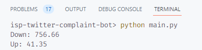
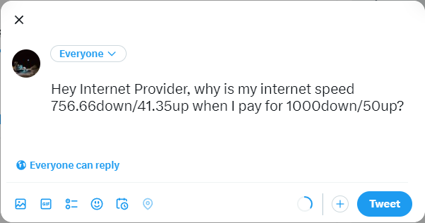
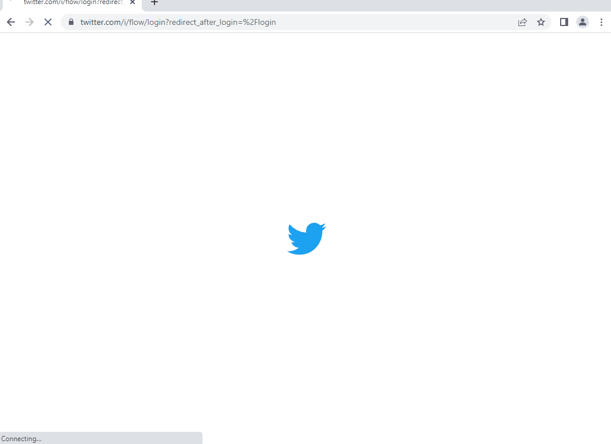

# Day 51: ISP Twitter Complaint Bot

Get your download and upload speeds from [speedtest.net](https://www.speedtest.net/) and send a tweet to your ISP complaining that your speeds are below what they promised.

>Additional tools learned:
>- Used Windows instead of a Mac to code 
>    - Selenium browser was running extremely slow on my Mac. After hours of Google research and testing, I switched over to my Windows PC. Selenium performance is near 100% now.
>- Used ScreentoGif instead of GIPHY Capture to record demo gifs
>    - GIPHY Capture is not available for Windows so I had to find an alternative.
>    - Demo GIFs can be longer than 30 seconds.
>    - I learned how to shorten, edit, and obfuscate GIFs.

## 1. Getting results from Speedtest.net

### Speed test demo (abridged)

- Shows the Selenium browser first being launched
- `GO` button is hit to start speed test
- Speedtest ad is closed, if it pops up
- View speed test results showing download and upload speeds

## 2. Console output after speed test is run

- Download and upload speeds are scraped and printed in the terminal
- Speeds in console match what's shown on Speedtest.net

## 3. Sending the complaint on Twitter

### Logging in to Twitter
- Right after the speed test, the browser redirects to the Twitter log in page
- After trial and error, providing a phone number or username to log in gives a smoother user login experience. 
   
    Using your email to log in frequently adds a verification step where it prompts you to type your username before entering your password.

### Sending the tweet
- Since I'm not actually sending a complaint, I didn't @ my ISP in my test tweet.

    ### Tweet to send

    

    ### Confirmation that tweet was sent

    

### Twitter demo

