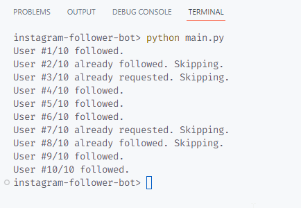
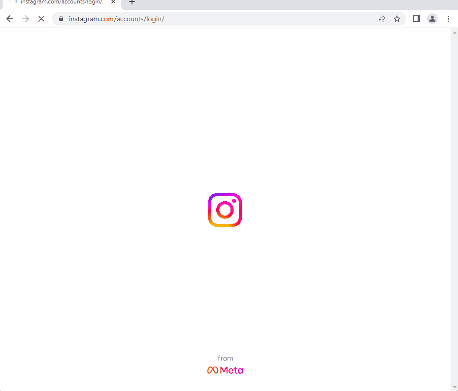

# Day 52: Instagram Follower Bot

### Create a bot that automates following followers of any popular Instagram page. 

## Console output

## Demo steps

1. Logging in to Instagram
2. Dismissing pop-ups that ask if you want to:
    - Save your login info
    - Turn on notifications
3. Navigating to target Instagram page
4. Clicking on number of followers to open Followers page
5. Following users if not already following or requested
6. Scrolling down starts once script hits last visible user
    - Currently, that is the 6th user
    - Then scrolls to next user one by one
7. Closing the browser once specified number of users is met

## Demo run (54 seconds)

In this example, we use the following variables in the script:
- `TARGET_PAGE = "chihuahuasfan"`: target Instagram page to get followers
- `FOLLOW_COUNT = 10`: number of users to attempt to follow

 

