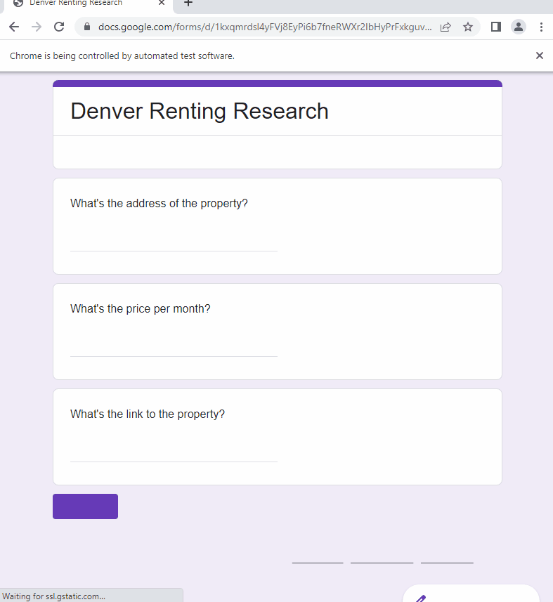

# Day 53: Data Entry Job Automation

## Capstone Project 

Create a bot using Beautiful Soup and Selenium to pull Zillow rental property information and submit it via individual Google Forms responses into a Google Sheets file

## Project Requirements
1. Use BeautifulSoup/Requests to scrape all the listings from the Zillow web address.
2. Create a list of links for all the listings you scraped.
3. Create a list of prices for all the listings you scraped.
4. Create a list of addresses for all the listings you scraped.
5. Use Selenium to fill in the form you created. Each listing should have its price/address/link added to the form. You will need to fill in a new form for each listing.

## Custom Zillow page to scrape

We use `Denver, CO` and additional search filters to create our custom URL.

Click to expand to view full URL

https://www.zillow.com/homes/for_rent/?searchQueryState=%7B%22pagination%22%3A%7B%7D%2C%22mapBounds%22%3A%7B%22west%22%3A-105.41866987436256%2C%22east%22%3A-104.53701704233131%2C%22south%22%3A39.42166387642381%2C%22north%22%3A39.963230707270434%7D%2C%22mapZoom%22%3A11%2C%22isMapVisible%22%3Atrue%2C%22filterState%22%3A%7B%22price%22%3A%7B%22min%22%3A306345%2C%22max%22%3A421225%7D%2C%22beds%22%3A%7B%22min%22%3A1%2C%22max%22%3A1%7D%2C%22baths%22%3A%7B%22min%22%3A1%7D%2C%22built%22%3A%7B%22min%22%3A1990%7D%2C%22fore%22%3A%7B%22value%22%3Afalse%7D%2C%22mf%22%3A%7B%22value%22%3Afalse%7D%2C%22lau%22%3A%7B%22value%22%3Atrue%7D%2C%22ac%22%3A%7B%22value%22%3Atrue%7D%2C%22mp%22%3A%7B%22min%22%3A1600%2C%22max%22%3A2200%7D%2C%22ah%22%3A%7B%22value%22%3Atrue%7D%2C%22auc%22%3A%7B%22value%22%3Afalse%7D%2C%22nc%22%3A%7B%22value%22%3Afalse%7D%2C%22fr%22%3A%7B%22value%22%3Atrue%7D%2C%22land%22%3A%7B%22value%22%3Afalse%7D%2C%22sdog%22%3A%7B%22value%22%3Atrue%7D%2C%22ldog%22%3A%7B%22value%22%3Atrue%7D%2C%22manu%22%3A%7B%22value%22%3Afalse%7D%2C%22fsbo%22%3A%7B%22value%22%3Afalse%7D%2C%22cmsn%22%3A%7B%22value%22%3Afalse%7D%2C%22fsba%22%3A%7B%22value%22%3Afalse%7D%7D%2C%22isListVisible%22%3Atrue%7D

 

## Console output

Output of property details is printed in the terminal before running the Google Forms automation part of the project.

## Auto fill and submit each response on Google Forms

The number of seconds `n` in the `time.sleep(n)` function can be changed to accommodate slower or faster browser loading time.

The `address`, `price`, and `link` for each property is filled in before submitting the form and refreshing the page to start a new response form.

## Information populates in Google Sheets file

Demo below has been sped up to quickly show results.

