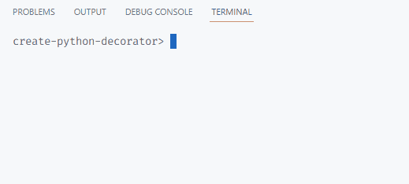

# Day 54: Create Your Own Python Decorator

## Interactive Coding Exercise (no project)

### Instructions

- `time.time()` will return the current time in seconds since January 1, 1970, 00:00:00
- Try running the starting code to see the current time printed.
- If you run the code after a while, you'll see a new time printed.

Given the above information, complete the code exercise by printing out the speed it takes to run the `fast_function()` vs. the `slow_function()`. You will need to complete the `speed_calc_decorator()` function.

### Starting code

```
import time
current_time = time.time()
print(current_time)

def speed_calc_decorator():
    pass

def fast_function():
    for i in range(10000000):
        i * i
        
def slow_function():
    for i in range(100000000):
        i * i
```

### Ending code

```
import time
current_time = time.time()
# print(current_time)

def speed_calc_decorator(speed_function):
    def wrapper_function():
        start_time = current_time
        speed_function()
        end_time = time.time()
        difference = end_time - start_time
        print(f"{speed_function.__name__} run speed: {difference}s")
    return wrapper_function

@speed_calc_decorator
def fast_function():
    for i in range(10000000):
        i * i

@speed_calc_decorator       
def slow_function():
    for i in range(100000000):
        i * i
        
fast_function()
slow_function()
```

### Console output


