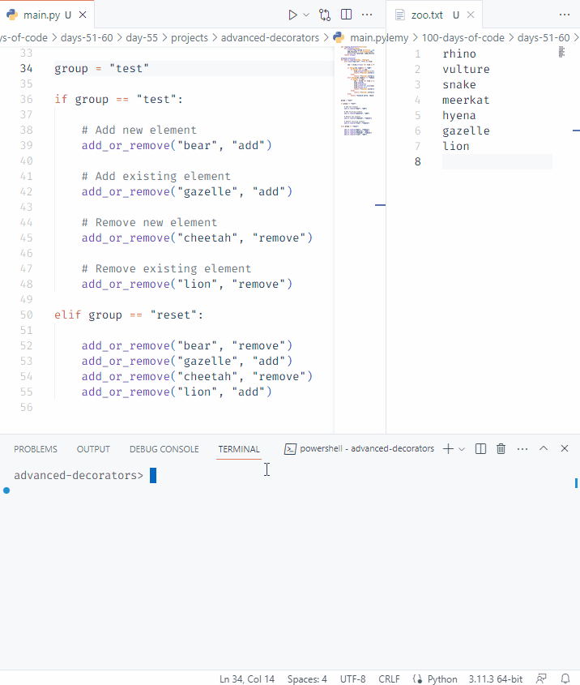

# Day 55: Advanced Decorators

## Interactive Coding Exercise (no project)

### Instructions

- Create a `logging_decorator()` which is going to log the name of the function that was called, the arguments it was given and finally the returned output

- A custom `zoo()` function was built to add or remove animals from a list. 
    - Add only if new animal
        - If animal already exists, it is not added.
    - Remove only if existing animal
        - If animal does not exist, it cannot be removed.

### Console output

- `bear` is added because it is a new element.
- `gazelle` fails to add because it already exists.
- `cheetah` fails to remove because it already does not exist.
- `lion` is removed because it is an existing element.

 

