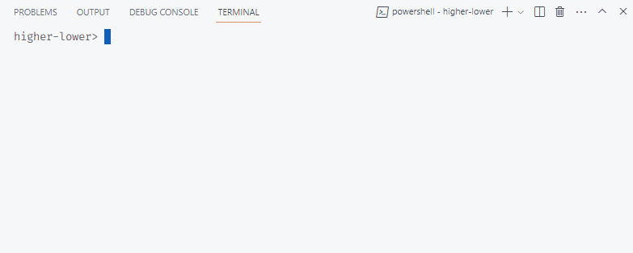

# Day 55: Higher or Lower URLs

Guess the number by going to the right URL path.

### Instructions

1. Create a new project called **higher-lower** and add a **server.py** file.
2. Create a new Flask application where the home route displays an `<h1>` that says "Guess a number between 0 and 9" and display a gif of your choice from [giphy.com](https://giphy.com).
3. Generate a random number between 0 and 9 or any range of numbers of your choice.
4. Create a route that can detect the number entered by the user e.g. "URL/3" or "URL/9" and checks that number against the generated random number.

### Console output

We print a logging message with the correct number to guess for our own information. In this case, the correct number is `4`.

Then the terminal outputs messages every time a new URL path is visited. In the case below, paths `/1`, `/8`, and `/4` were visited in that order.

### Demo run

We open the local path shown in the console `https://127.0.0.1:5000`.

To guess the number, we try paths `/1`, `/8`, and `/4` in that order.

All numbers lower than the correct guess show the same `'too low'` page content. Likewise, all numbers higher than the correct guess show the same `'too high'` page content.

