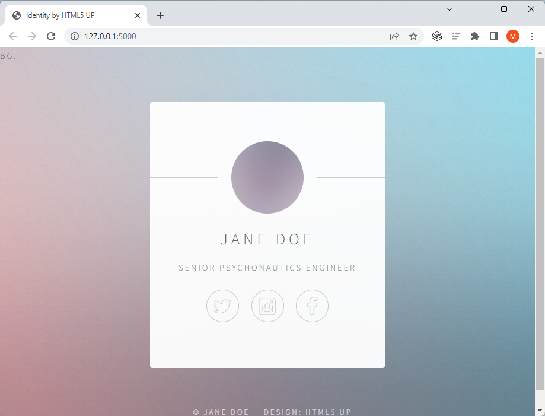
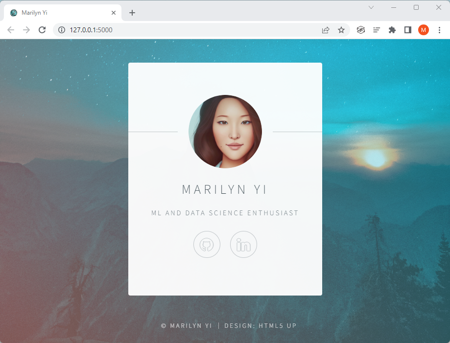

# Day 56: Name Card Website Template

Use one of the templates on [HTML5 UP](https://html5up.net/) to create a web-based name card. 

### Instructions

1. Download HTML5 UP's "Identity" template from this lesson's resources. A different template can be used instead e.g. "Astral" or "Ethereal".
2. Create a new project called **name-card** and create a new Flask application from scratch.
3. Create the necessary folders and move the relevant files from the download in Step 1.
4. Get the website to work when you access the root route `("/")`.
5. Personalize the website, change the background image, change the text, change the links, make it your own.

### Project adaptations 

- **Downloading the "Identity" template**: It doesn't like the "Identity" template exists on HTML5 UP anymore so we downloaded the `html5up-identity` zip file provided in the course. A copy of the file can be downloaded from this repo.
- **Replacing the background image**: We use a random "night sky" photo by <a href="https://unsplash.com/pt-br/@mischievous_penguins?utm_source=unsplash&utm_medium=referral&utm_content=creditCopyText">Casey Horner</a> on <a href="https://unsplash.com/s/photos/night?utm_source=unsplash&utm_medium=referral&utm_content=creditCopyText">Unsplash</a>.
  

### Before customization

### After customization

- Tab: Added favicon and changed the title tag
- Page: 
    - Changed content text and link icons
    - Replaced avatar and background images

