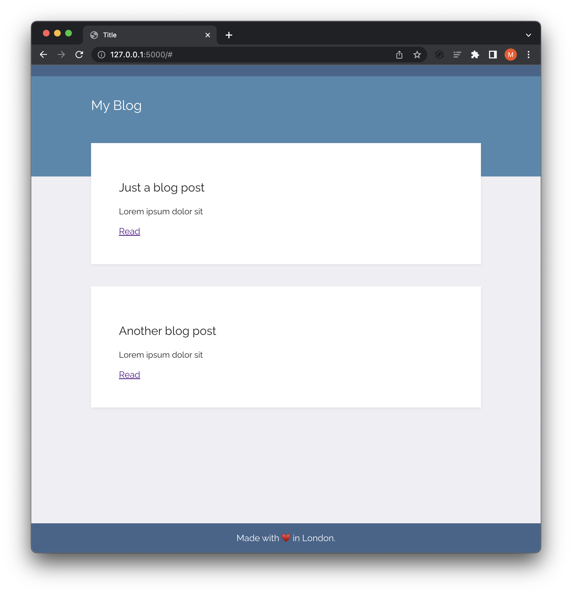
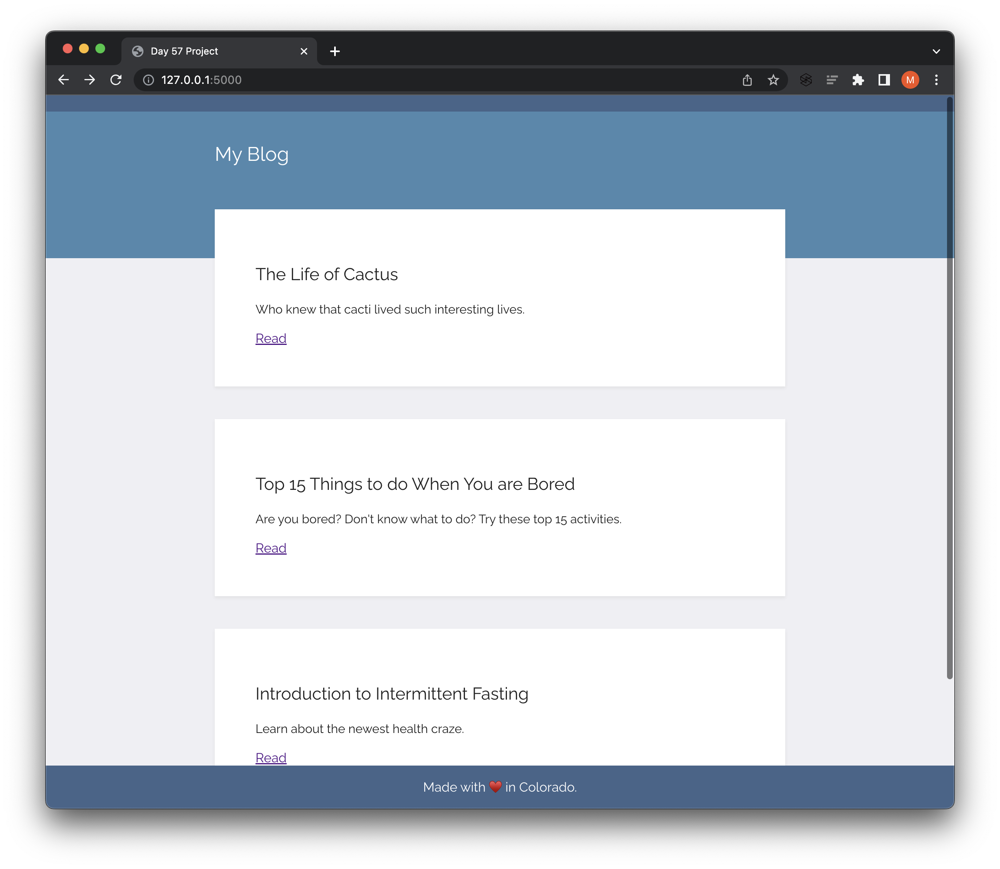
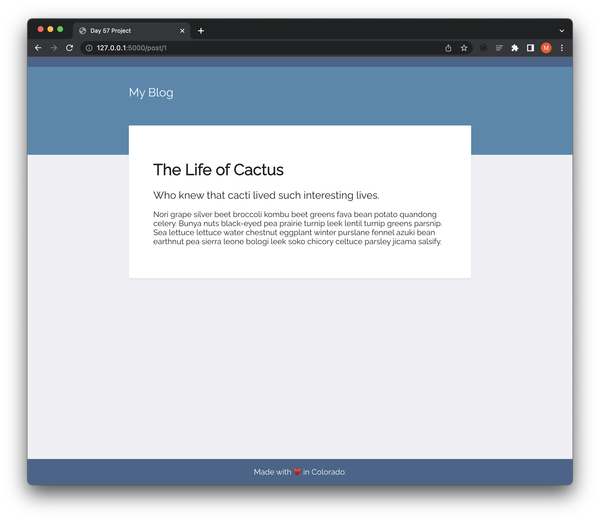

# Day 57: Blog Capstone Project Part 1 - Templating

Use one of the templates on [HTML5 UP](https://html5up.net/) to create a web-based name card. 

### Instructions

1. Head over to the course resources and download the starting files for this project: `blog-templating-start.zip`.
2. Run the **main.py** file and you should see the following styling and website rendered:

3. Using the API for our blog posts we created on n:Point, render all the blogs' titles and subtitles on the home page.
4. Make a "**Read**" anchor tag at the end of each blog post preview link to a page with the entire blog - `title`, `subtitle`, and `body`. The indivivdual blog posts should live at the path: URL/post/blog_id

### Project adaptation

- The starting project files included a `post.py` file to create a `Post` class. This added unnecessary complexity so I removed the file.

### After customization

**Home Page**

**Individual Blog Post**

Clicking on the `Read` hyperlink takes you to the full blog post. In the example below, we visit the first one.

