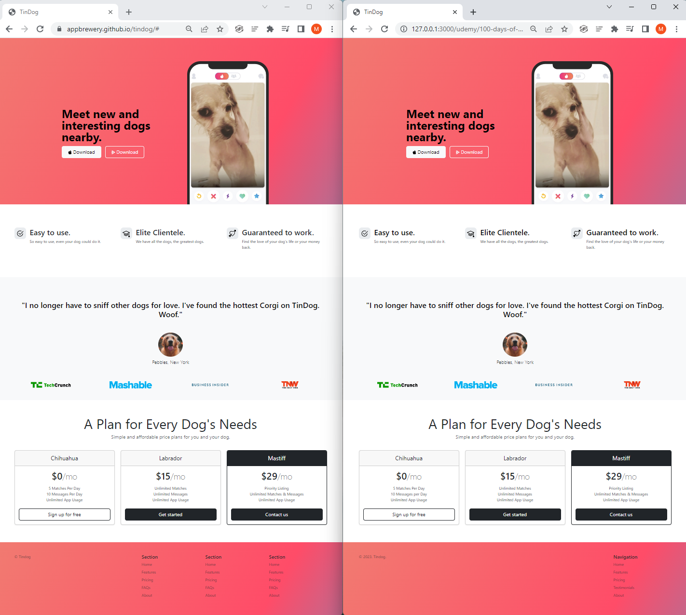

# Day 58: TinDog Project

Build a TinDog (Tinder for Dogs) startup website using Bootstrap.

## Comparison 

Left: Solution, Right: Project output

## Project Files

### Instructions
- `goal images/`
- `elements.md`
- `starting_code.html`

### Project
- `css/style.css`
- `images/`
- `index.html`

### Solution
- `css/solution.css`
- `images/`
- `solution.html`

