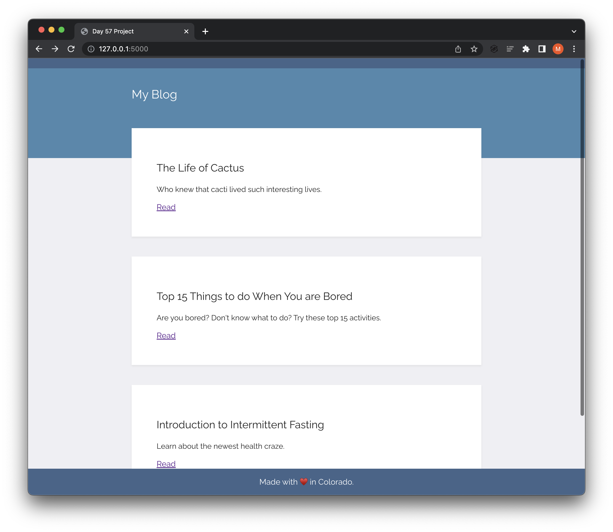
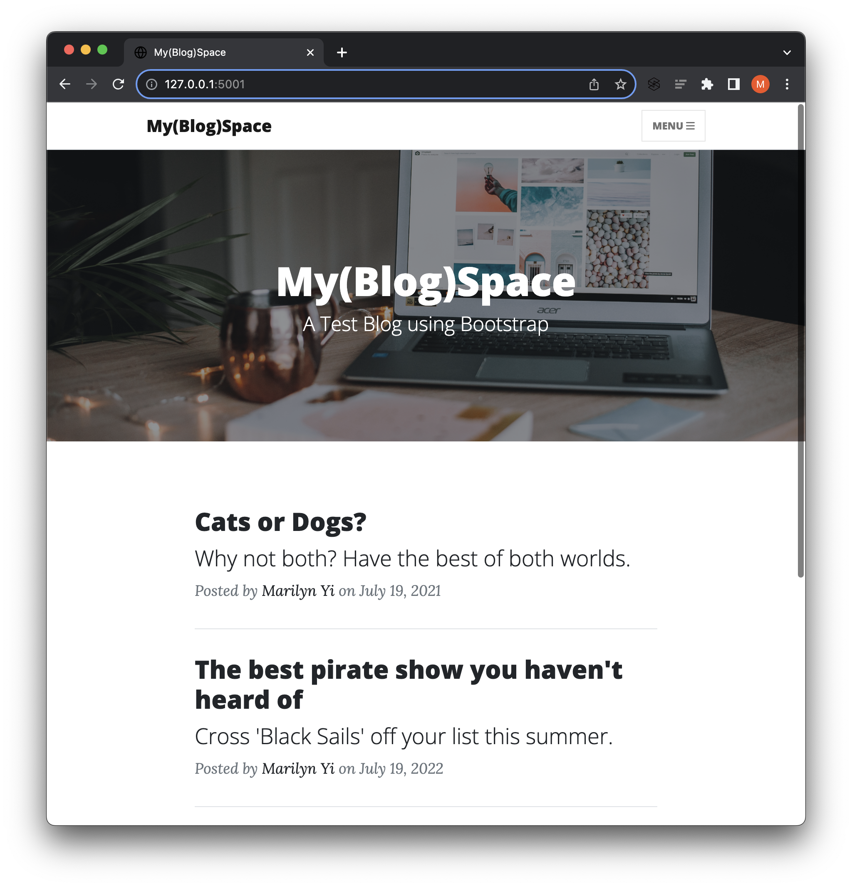

# Day 59: Blog Capstone Project Part 2 - Adding Styling

Build upon the simple blog with simple CSS styling created using Bootstrap on Day 57 to include the following new features:
- **multi-page** website with an **interactive** navigation bar
- **dynamically** generated blog post pages with full screen titles
- fully **mobile responsive** with an adaptive navigation bar

## Project Steps

1. Download the starting project
2. Get the home page to work
3. Fix the header and footer
4. Use Jinja to render templates
5. Make the 'About' and 'Contact' pages work
6. Fetch and render the blog posts from an API
7. Render individual posts

## Home Page Comparison

### Home Page: Before

### Home Page: After

## Demo

### Showing Blog Posts

### Showing Pages

### Photo Credits

- `Home` page:
    - Background Photo by <a href="https://unsplash.com/@anete_lusina?utm_source=unsplash&utm_medium=referral&utm_content=creditCopyText">Anete Lūsiņa</a> on <a href="https://unsplash.com/photos/zwsHjakE_iI?utm_source=unsplash&utm_medium=referral&utm_content=creditCopyText">Unsplash</a>
- `About` page:
    - Background Photo by <a href="https://unsplash.com/@nasa?utm_source=unsplash&utm_medium=referral&utm_content=creditCopyText">NASA</a> on <a href="https://unsplash.com/images/nature/space?utm_source=unsplash&utm_medium=referral&utm_content=creditCopyText">Unsplash</a>
- `Contact` page:
    - Background Photo by <a href="https://unsplash.com/it/@engine9?utm_source=unsplash&utm_medium=referral&utm_content=creditCopyText">Andrey  Larin</a> on <a href="https://unsplash.com/photos/Kodkas71tT8?utm_source=unsplash&utm_medium=referral&utm_content=creditCopyText">Unsplash</a>
- `Cat or Dog` blog post:
    - Background Photo by <a href="https://unsplash.com/fr/@krista?utm_source=unsplash&utm_medium=referral&utm_content=creditCopyText">Krista Mangulsone</a> on <a href="https://unsplash.com/photos/9gz3wfHr65U?utm_source=unsplash&utm_medium=referral&utm_content=creditCopyText">Unsplash</a>
- `Pirate` blog post:
    - Background Photo by <a href="https://unsplash.com/ko/@theodoridou?utm_source=unsplash&utm_medium=referral&utm_content=creditCopyText">Elena Theodoridou</a> on <a href="https://unsplash.com/photos/h0jsVAp3emY?utm_source=unsplash&utm_medium=referral&utm_content=creditCopyText">Unsplash</a>
- `Space` blog post:
    - Background Photo by <a href="https://unsplash.com/es/@nypl?utm_source=unsplash&utm_medium=referral&utm_content=creditCopyText">The New York Public Library</a> on <a href="https://unsplash.com/photos/kvHhSroTNPY?utm_source=unsplash&utm_medium=referral&utm_content=creditCopyText">Unsplash</a>
  
  
  

