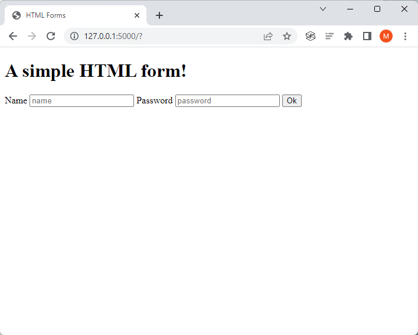

# Day 60: Make the Contact Form Work

The Day 59 project was to create an upgraded version of the Day 57 blog website, using Bootstrap for styling. The only part of the website that doesn't work is the contact form on the 'Contact' page.

In this project, the goals are to understand how HTML forms are submitted and how to use the data from the form to actually send an email to ourselves with the data submitted by the user.

# Project Steps

## 1. Creating a Form from Scratch

We create a new [`index.html`](https://github.com/marilynyi/100-days-of-code-python/tree/main/days-51-60/day-60/examples/html-forms/templates/index.html) and [`main.py`](https://github.com/marilynyi/100-days-of-code-python/tree/main/days-51-60/day-60/examples/html-forms/main.py) file to output the following on our local server. Note the 'Ok' button is not fully functional in this step.

## 2. Handle POST Requests with Flask Servers

Using the following resources from w3schools, we configure the HTML form to submit a `POST` request to the path `/login` and return the username and password 

## 3. Getting the Contact Form to Work

We create a copy of the Day 59 project and then edit the existing [`index.html`](https://github.com/marilynyi/100-days-of-code-python/tree/main/days-51-60/day-60/project/blog-capstone/templates/index.html) and [`main.py`](https://github.com/marilynyi/100-days-of-code-python/tree/main/days-51-60/day-60/project/blog-capstone/main.py) files to interact with the website properly.

When the `Send` button is clicked,
1. the user is presented with a refreshed 'Contact' page, replacing the title and subtitle with 'Successfully sent your message." title, and 
2. the fields that are entered are printed as terminal messages in the IDE

## 4. Sending Email with smtplib

When the `Send` button is clicked,
1. the user is presented with a refreshed 'Contact' page, replacing the title and subtitle with 'Successfully sent your message." title, and 
2. the fields are sent in an email message using Gmail SMTP

  