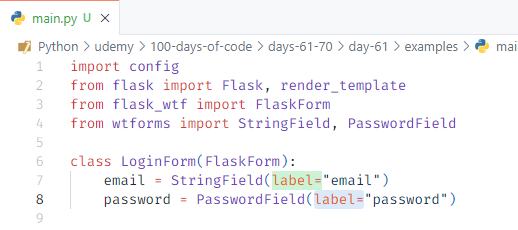
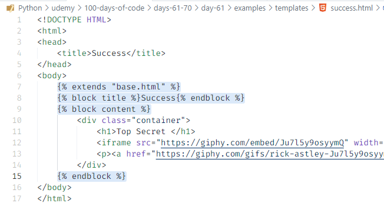
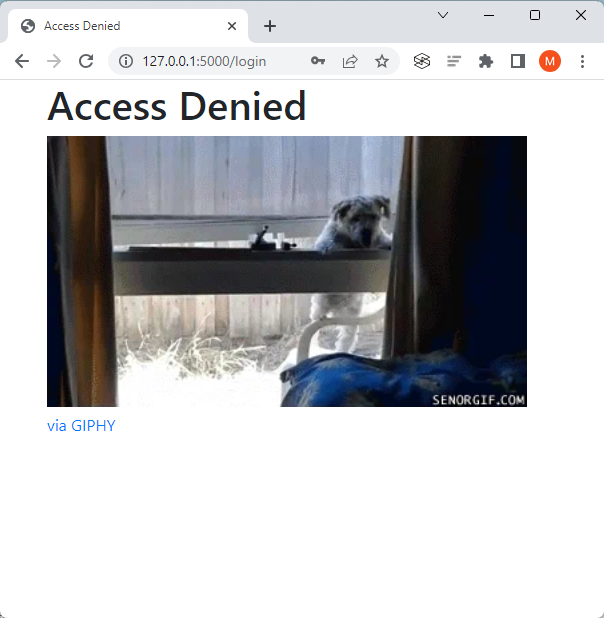

# Day 61: Building Advanced Forms

We improve upon the HTML form we built on Day 60 by building forms using 

1. the Flask extension **Flask-WTF** 

    >A deep dive is done first using Flask-WTF to familiarize ourselves with the various building blocks to create the form and validation elements. 
    
    It has a number of benefits over the simple HTML form, e.g.

    - Easy form validation
    - Less code
    - Built in CSRF protection

2. the Python extension **Bootstrap-Flask**

    This quickly renders a form with built-in validation with a single line of code, making it more efficient to use than Flask-WTF.


# Project Steps

## Installing Flask-WTF

>`pip install Flask-WTF`

## Creating Forms with Flask-WTF

Using the [Flask-WTF Quickstart - Creating Forms](https://flask-wtf.readthedocs.io/en/1.0.x/quickstart/) documentation, we build a simple login form with the following specifications:
- It must have an `email` and `password` field.
- They can both be `StringFields`.
- Both `email` and `password` inputs should be size **30**.
- Any `<label>` or `<input>` elements should not need to be created manually using HTML.

Optionally, we add csrf protection by including the following code in the `login.html` file:

`{{ form.csrf_token }}`

and a secret key in the `main.py` file, which is used to generate the csrf_token:

`app.secret_key = "some secret string"`


## Code Improvements for Our WTForms

On top of the Quickstart guide, there are several improvements we can make:

- WTForms has [built-in basic fields](https://wtforms.readthedocs.io/en/3.0.x/fields/#basic-fields) other than `StringField`. We can change the `password` input in `main.py` to use a `PasswordField` instead of `StringField` to obscure the text typed into the input.

    **Before:**

    

    **After:**

    

- The arguments given when creating a `StringField` or `PasswordField` is for the `label` property of the form field. We add the keyword argument string `label=` to clarify the argument.

    

- In the Quickstart, the form action was set to `"/"` which is a static path. We dynamically build the URL by removing it, essentially replacing `'/login'` with `'login'`.

    

- We format the layout of the labels and inputs in our WTForms generated form by using normal HTML elements. 

    

    <br>

    The form layout runs vertically by adding paragraph and line break elements. 

    


## Adding Validation to Forms with Flask-WTF

- WTForms has [built-in validation](https://wtforms.readthedocs.io/en/3.0.x/validators/#module-wtforms.validators) which we can implement into our code by adding the following highlighted items in `main.py`:

    

- When a form is submitted, there may be a number of errors, so a list of `errors` can be generated and passed over to our form HTML as a `form.<field>.errors` property on the field which generated the error.

    Adding the following highlighted code, we tap into these errors and loop through them to show some text when an error appears.

    

- We then add the code highlighted below to tell our form to validate the user's entry when they hit submit. This way it is able to respond to `POST` requests and then to `validate_on_submit()`.

    

- Some browsers have their own built-in validation mechanism while some don't. To make sure validation is on regardless of what browser is used, we include the `novalidate` attribute to the form element.

    

    This then displays the validation message below if a field is left empty when trying to submit the form.

    

- Lastly, we add `Email` and `Length` validators using the following highlighted code to ensure that a **valid email** (with "@" and ".") is entered and the password length is at least **8 characters**.
    >In order for the `Email` validator to work, we install the package:
    >
    >`pip install wtforms[email]`.

    

    Typing in `testaddress@gmailcom` without the `'.'` and adding a password less than 8 characters displays the following validation messages.

    

## Receiving Form Data with WTForms

We check the return value of `validate_on_submit()` which will be `True` if validation was successful **after the user submitted the form** or `False` if it failed. Referring to WTForm's [How Forms get data](https://wtforms.readthedocs.io/en/3.0.x/crash_course/#how-forms-get-data) section, we do this with an `if` statement.

More specifically, we update the `/login` route in `main.py` so that if a form was (1) **submitted**, (2) **validated**, and (3) their credentials **matched** the following:
- email: **admin@email.com**
- password: **password123**

then the user is shown the **success.html** page.


Otherwise, the user is shown the **denied.html** page.


## Inheriting Templates Using Jinja2

We implement template inheritance to extend style templates from a parent webpage to child webpages. First, we create the parent `base.html` file. 

Then we rewrite the `success.html` and `denied.html` pages to inherit from the `base.html` template adding the highlighted code snippets below:

**success.html**



The `lightblue` background comes from the parent `base.html`.


**denied.html**


The red `h1` super tag is added to `denied.html`. The `lightblue` background comes from the parent `base.html`.


## Installing Bootstrap-Flask

>`pip install bootstrap-flask`

## Using Bootstrap-Flask as an Inherited Template

The appearance of our website can be quickly improved using the Bootstrap-Flask Python extension. We initialize it in `main.py.`

We remove the super block in `denied.html` and the background color style in `base.html`. Then we load in Bootstrap in `base.html` as follows:


This outputs the success and access denied pages with Bootstrap elements (visible because of the font change).

**Success page**


**Access Denied page**



### Bootstrap-Flask Supports WTForms

With WTForms, we had to create form and validation elements. 

>The HTML head and body sections can be removed when fully implementing Bootstrap-Flask instead of WTForms. To preserve the project steps, these have been left in.

With Bootstrap-Flask, we remove the form and validation elements we wrote and then create a form element with a single line of code:

```
{{ render_form(form) }}
```

This produces a form that looks like this:


The form created with Bootstrap-Flask comes with  built-in validation. Below are examples of the validation messages:

**Invalid email**


**Password length too short**

