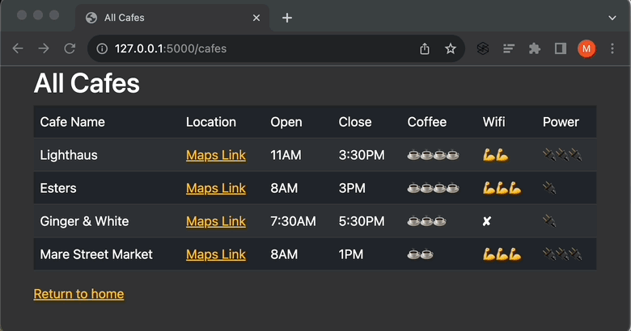
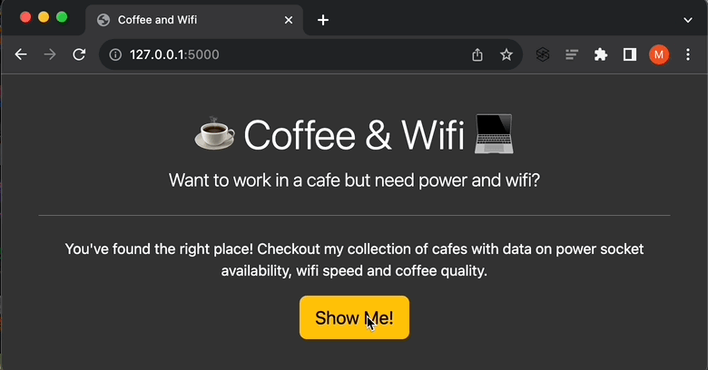

# Day 62: Coffee and Wifi

We build a website to store and list cafes, locations, and ratings (coffee quality, wifi strength, and power socket availability).

Just like a real client project, the front-end has already been built. The main goal is to ensure full comfort with Flask-WTF, Bootstrap-Flask, Bootstrap classes, and csv manipulation.

## Project Demo (30 seconds)

For bitesize demos, see the Project Walkthrough section.

### Showcasing the website


### Adding a new cafe (Requirement 8)


## Project Requirements
1. The home page should use the **css/styles.css** file.

    >Hint: Think about adding [bootstrap blocks](https://bootstrap-flask.readthedocs.io/en/stable/basic/#starter-template) to the base.html and linking it to the style sheet.

2. The `/cafes` route should render the cafes.html file. This file should contain a [Bootstrap table](https://getbootstrap.com/docs/5.3/content/tables/#overview) which displays all the data from the cafe-data.csv.

    >Hint: An object called `cafes` is passed to cafes.html from the `/cafes` route. Try putting it in a \<p> to see what the data in `cafes` looks like.

3. The location URL should be rendered as an anchor tag `<a>` in the table instead of the full link. It should have the link text "Maps Link" and the href should be the actual link.

    >Hint: All location links have the first 4 characters as "`http`".

4. Clicking on the "Show Me!" button on the home page should take you to the cafes.html page.
   
5. There should be a secret route `/add` which doesn't have a button, but those in the know should be able to access it and it should take you to the add.html file.
   
6. Use what you have learned about WTForms and Bootstrap-Flask to use `render_form` in the add.html page.

    >Hints: 
    >- https://flask-wtf.readthedocs.io/en/1.0.x/quickstart/
    >- https://bootstrap-flask.readthedocs.io/en/stable/macros/#render-form
    
<br>

7. Make sure that the location URL field has validation that checks the data entered is a valid URL.

    >Hints:
    >- https://wtforms.readthedocs.io/en/2.3.x/validators/
    >- How to switch off client-side (browser) validation with quick_forms: https://stackoverflow.com/a/61166621/10557313

<br>

8. When the user successfully submits the form on add.html, make sure the data gets added to the cafe-data.csv. It needs to be appended to the end of the csv file. The data from each field need to be comma-separated like all the other lines of data in cafe-data.csv.

    >Hint: https://www.w3schools.com/python/python_file_write.asp

9. Make sure all the navigation links in the website work.

# Project Walkthrough

## Setup

### Reinstalling Bootstrap-Flask

[Flask-Bootstrap and Bootstrap-Flask can’t live together](https://bootstrap-flask.readthedocs.io/en/latest/migrate/), so we uninstall Flask-Bootstrap first which also uninstalls Bootstrap-Flask. Then install Bootstrap-Flask:

```
pip uninstall flask-bootstrap
pip install bootstrap-flask
```

and/or 

```
pip3 uninstall flask-bootstrap
pip3 install bootstrap-flask
```

### Downloading the starting files

I removed the `requirements.txt` file from the zip as it was outdated. 

[`starting-coffee-and-wifi.zip`]("starting-coffee-and-wifi.zip")

### Viewing the starting template

The starting webpages have minimal formatting:


## Fulfilling Requirements 

### R1. Loading Bootstrap-Flask CSS in base.html

We add the code snippets highlighted below to load Bootstrap-Flask CSS in base.html and link it to the stylesheet:


The webpages now look like the following:


### R2. Displaying cafe data in `/cafes`

We display the first row in cafe-data.csv as the table header which includes `Cafe Name`, `Location`, `Open`, `Close`, `Coffee`, `Wifi`, and `Power`. Subsequent rows make up the table body.

The code is added to cafes.html:


Also to cafes.html above, we change the text 'Return to index page' to 'Return to home' and add the home URL.


### R3. Rendering links to Google Maps locations

To add hyperlinks for the cafe locations, we use a conditional `if` statement to find csv cells that contain the string "http". The highlighted code is added to the table body section of cafes.html:


The location URLs are now hyperlinked to the 'Maps Link' strings.



### R4. Linking "Show Me!" button to `/cafes`

We add a link to the button href in index.html:


The links between the home and cafes pages are now active:



### R5. Having a secret `/add` route

This was already provided by the starting code.


### R6. Creating the new cafe entry form

We use the quick `render_form` macro using Bootstrap-Flask to create a form with validations for a new cafe entry with the following.
- Cafe name
- Location as a URL starting with "http"
- Opening time
- Closing time
- Coffee rating
- Wifi rating
- Power socket availability

In add.html, the highlighted code is added to render the Bootstrap-Form, override the browser's validation by setting novalidate to `True`, and set a link back to the cafes page with the URL in the anchor tag.


In main.py, we add a couple optional items, namely (1) setting the default ratings for coffee, wifi, and power to 4, and (2) ensuring that times entered are in the "##:##AM/PM" format by removing spaces and periods and setting AM/PM to uppercase.


The add page now contains a new cafe entry form:


### R7. Making sure the location URL is a valid URL

We import `URL` from `wtforms.validators` and add it to the validators list for the location string. 


In requirement 6, we overrode the browser's validation by setting novalidate to `True` in the `render_form` line so the error messages when improperly filling out the form are raised by Bootstrap-Flask.


### R8. Submitting a new cafe form

The demo walks through filling out the form fields in the add page and, upon submitting the form successfully, the cafe is added to the list in the cafes page. 

Note the opening and closing times entered ('8 AM' and '3:30 p.M.') are automatically reformatted in the list ('8AM and '3:30PM').


### R9. Ensuring all navigation links work

All href placeholders are filled in with their proper links in the index.html, add.html, and cafes.html files.


