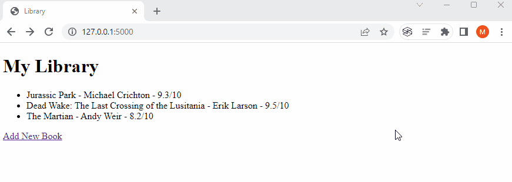
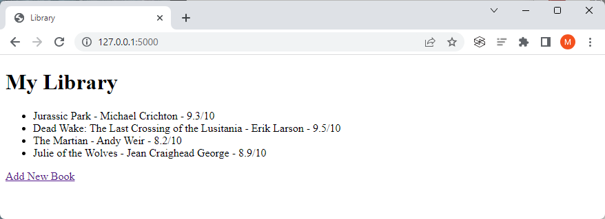
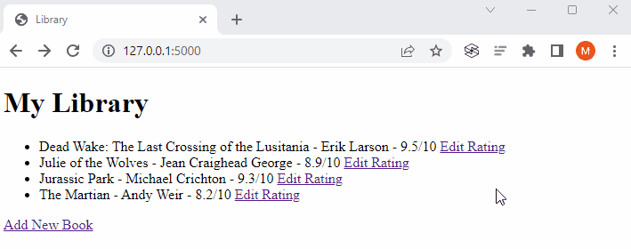
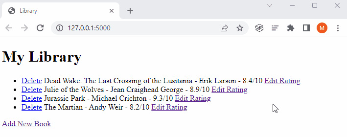

# Day 63: Library Project

In the example lessons, we built a [simple library website](https://github.com/marilynyi/100-days-of-code-python/tree/main/days-61-70/day-63/examples/starting-library) using Flask to add and store books. 

We add upon this website by building an SQLite database so that any books added are stored in the database. 

## Project Requirements

1. You should be able to **add** new books via the `/add` route. Once a book is successfully added to the database, it should redirect to the home page.

2. The home page should show all the books in the database. 

3. Add an Edit Rating Anchor Tag to each book `<li>`. When the button is pressed, it should take the user to an Edit Rating page where you can enter a new rating for that book. Then when you click "Change Rating" it should take you back to the home page and the new rating should be displayed next to the book.

    >Hint: You'll need to think about how to pass the book id as a parameter when you make the GET request to show the edit rating page. There are many ways you can do this. Here are some things that might help:
    >- https://flask.palletsprojects.com/en/2.3.x/quickstart/#url-building
    >- https://stackoverflow.com/questions/24892035/how-can-i-get-the-named-parameters-from-a-url-using-flask

4. Add a Delete Anchor Tag to each book listing `<li>`. When clicked it should delete the book from the database and redirect back to the home page.

# Project Demos

## R1. Adding new books 

## R2. Showing all books in the database

## R3. Adding Edit Rating anchor tags

## R4. Deleting books

