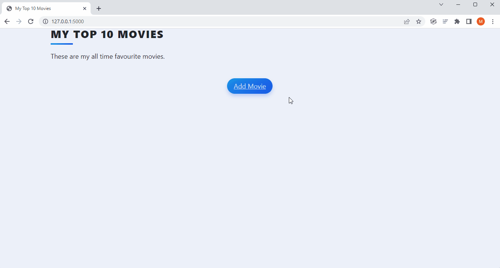

# Day 64: Top 10 Movies

We build a website that compiles a list of our top favorite movies of all time using Flask, WTForms, SQLite, and SQLAlchemy. It will allow us to create a beautiful website that lists our top 10 films of all time. As we watch more movies, we can always update our list and keep track of which movies to recommend people.

## Project Demo

Showcasing personal top 10 favorite movies with ratings and reviews.

## Project Requirements

1. View movie list items
2. Edit a movie's rating and review
3. Delete movies from the database
4. Add new movies via the Add page
5. Sort and rank the movies by rating

# Project Walkthrough

We start by downloading the starting files in "starting-files-top-movies.zip" with the following starting template: 

## R1. View movie list items 

1. Create an SQLite database with SQLAlchemy
2. Using code/DB Viewer, add a new entry to the database
3. Add a second movie to your database
4. Make the code work so that each entry in the database is displayed correctly on the home page

## R2. Edit a movie's rating and review

1. Use what you learned about WTForms to create the RateMovieForm. Use this to create a Quick Form to be rendered in edit.html.
2. Once the form is submitted and validated, add the updates to the corresponding movie entry in the database. 

## R3. Delete movies from the database

On the back of each movie card is a Delete button. Make this button work and allow the movie entry to be deleted from the database.

## R4. Add new movies via the Add page

1. Make the add page render when you click on the Add Movie button on the Home page. The Add page should render a WTF form that only contains 1 field - the title of the movie.
2. When teh user types a movie title and clicks "Add Movie", your Flask server should receive the movie title. Next, you should use the `requests` library to make a request and search The Movie Database API for all the movies that match that title.
    - You will need to sign up for a free account on The Movie Database.
    - Then you will need to go to Settings -> API and get an API Key.
    - You will need to read the documentation on The Movie Database to figure out how to request for movie data by making a search query.
3. Once the user selects a particular film from the select.html page, the id of the movie needs to be used to hit up another path in the Movies Database API, which will fetch all the data they have on that movie. 
   - Use the id of the movie that the user selected to make a request to the get-movie-details path.
   - The data you get back from the API should be used to populate the database with the new entry.
   - Once the entry is added, redirect to the home page and it should display the new movie as a card.
4. Instead of redirecting to the home page after finding the correct film, redirect to the edit.html page. 

## R5. Sort and rank the movies by rating

At the moment the front of the movie card says None in large letters. This is because we have not assigned a `.ranking`.

Instead, we want it to display the ranking of the movie according to our rating.

In the example below, we have rated The Matrix a score of 8.7 When we add Jurassic Park with a higher rating of 9.4, The Matrix is now ranked #2 and Jurassic Park takes the #1 spot.

