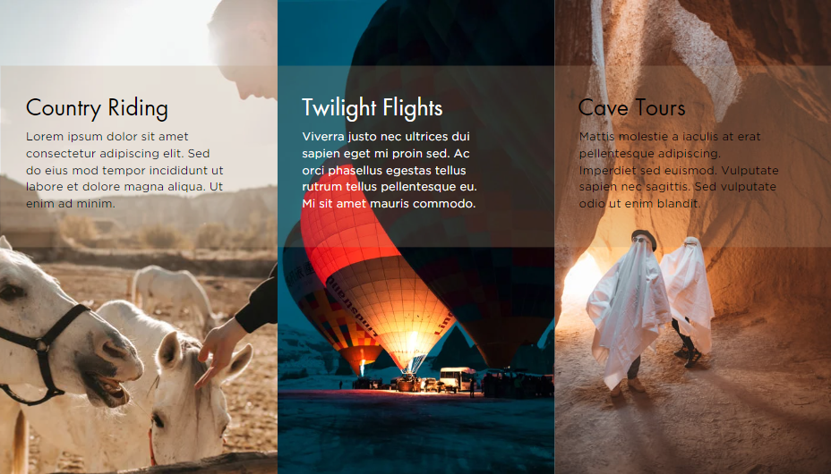
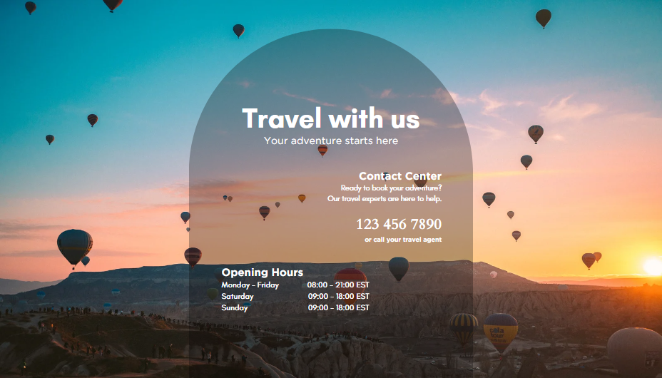

# Day 65: Creating a Website in Canva

We build a website in Canva by incorporating the following web design elements:
- Color Theory
- Typography and Choosing Fonts
- Effective User Interface (UI) Design to Manage Attention
- User Experience (UX) Design

## Project Demo

For this project, I chose a fictitious travel company site for Cappadocia, with a home page, list of iterary features, and contact information.

Canvas Project Link: [Visit Cappadocia](https://www.canva.com/design/DAFqhqRFrZU/sOj_ROtFSDLYxkgqJ70YhQ/view?utm_content=DAFqhqRFrZU&utm_campaign=designshare&utm_medium=link&utm_source=publishsharelink)

Screenshots of all three pages are shown below:

### Home Page

### Itinerary Features

### Contacts Page

