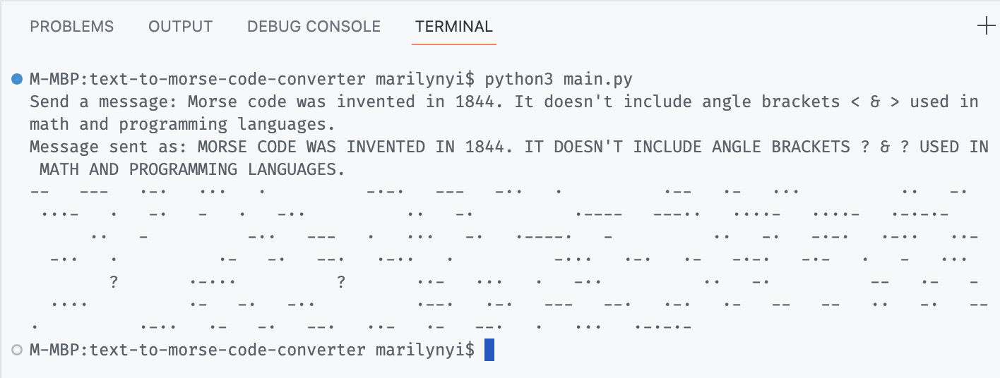
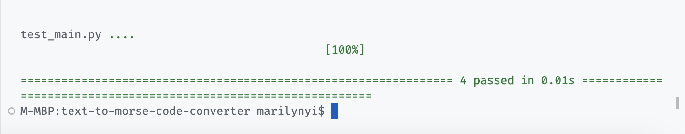

# Day 81: Text to Morse Code Converter

For this first unguided project, we create a command line program that takes in a String input and converts it into Morse Code.

Additional features I've included are:
1. Formatting the message in Morse Code standards before conversion
2. Implementing testing using Pytest

The official [Morse Code dictionary](https://en.wikipedia.org/wiki/Morse_code) includes standard letters, numbers, and 18 symbols. Each character is made up of dits (·) and/or dahs (-). Spaces between each character are three dits long and spaces between words are seven dits long.

## Example output

## Pytest output

